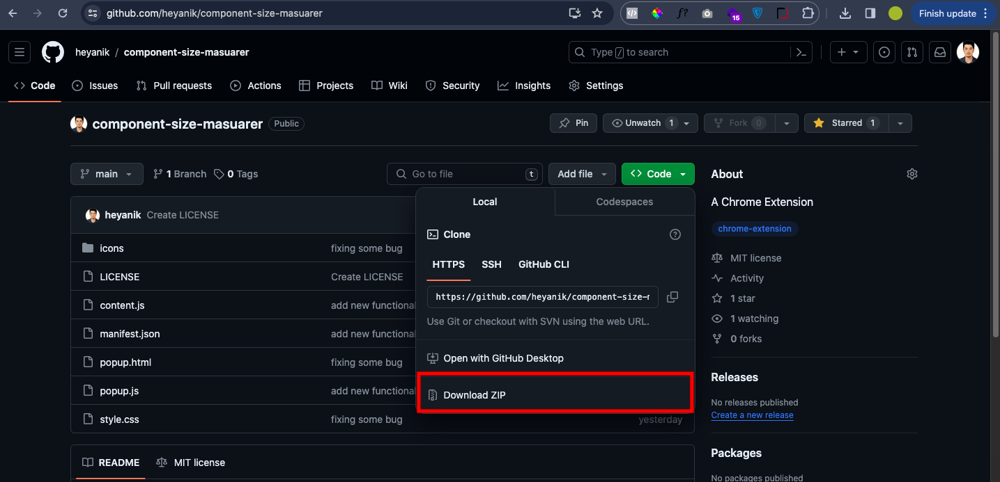

    
    <h1 align="center">Component Size Masuarer</h1>
    
Component size masuarer is a Chrome Extension develop by <a href="https://heyanik-beta.vercel.app">Anik</a> 

### What is Component Size Masuarer?
Component Size Masuarer is a tool for outlining a component in any
website. It's helpful to outline any size of component.

### Why should you use this?
Being a web developer myself, I can become irritated with the component size that I'm talking about at times. You can measure the size of the reference component with this tool. 

---

## 🚀 Demo

## How to use this?
I didn't upload this to Chrome Store. To be honest I don't have the money to pay as registration fee. But people can use this without Chrome store. How?

## ✅ Toturial 
> Step 1: Download the file. <a href="https://github.com/heyanik/component-size-masuarer">Download</a>

> Step 2: Go to Manage Extension on Chrome

> Step 3: If your Developer mode is turn off(By default) then turn it on.

> Step 4: When you turn on the Developer mode you'll see Load unpacked. Click it.

> Step 5: Unzip the download file and upload it.

> Step 6: 💥Done

> [!TIP]
>Pin the extension to use it regularly.

---

>If you're going to use it, please don't forget to give the repository a star. It'll motivate me to develop things like this. And also, I can see how many of you're using it.❤️

---

> [!NOTE]  
> Ignore the error massages on extension page.
